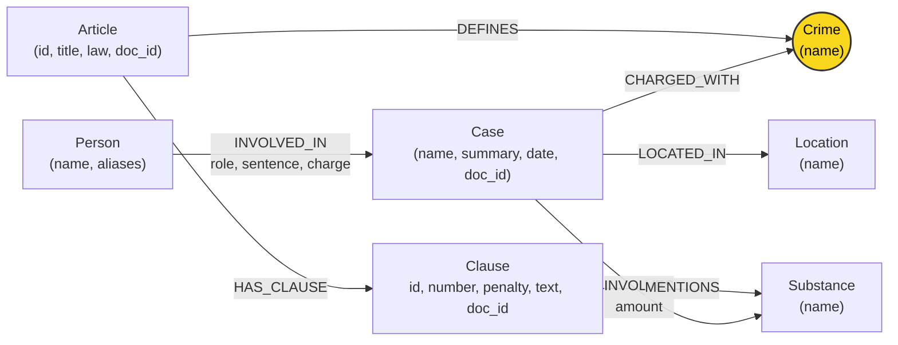

# Thiết kế Ontology — Day 19

**Họ tên:** Hoàng Trung Hiếu  **MSSV:** 2A202602945

**Lựa chọn** (đánh dấu một):
- [x] Dùng ontology gợi ý (có cải tiến bổ sung quy tắc ngữ cảnh tối đa và tổng hợp)
- [ ] Tự thiết kế (xét bonus +15, xem `SUBMISSION.md`)

> Hướng dẫn: `LAB_GUIDE.md` Bước 2. Dùng ontology gợi ý thì vẫn phải điền đủ các mục dưới đây bằng lời của bạn.

## 1. Sơ đồ

> **Node cầu nối**: Node `Crime` (màu vàng) là thực thể trung tâm bắc cầu giữa kho tri thức văn bản quy phạm pháp luật (KB Luật) và kho tri thức các vụ án thực tế (KB Tin tức).

---

## 2. Entity types (node labels)

| Label | Ý nghĩa | Khóa định danh (`MERGE` theo) | Properties | Lấy từ KB nào | Trích bằng (regex / LLM / khác) |
| :--- | :--- | :--- | :--- | :--- | :--- |
| `Article` | Điều luật trong Bộ luật Hình sự hoặc Luật PCMT | `id` (ví dụ: `"Điều 251 BLHS"`) | `id`, `title`, `law`, `doc_id` | KB luật | Regex từ front-matter & tiêu đề markdown |
| `Clause` | Khoản luật thuộc Điều luật quy định khung hình phạt | `id` (ví dụ: `"Điều 251 BLHS khoản 1"`) | `id`, `number`, `penalty`, `text`, `doc_id` | KB luật | Regex theo cấu trúc `^(\d+)\.\s` |
| `Crime` | Tên tội danh pháp lý chuẩn hóa (node cầu nối) | `name` (ví dụ: `"mua bán trái phép chất ma túy"`) | `name` | Cả hai KB | Tiêu đề Điều luật (regex) & LLM + `link_entity` |
| `Case` | Vụ án / vụ việc cụ thể xảy ra trong thực tế | `name` (tên định danh vụ án) | `name`, `summary`, `date`, `doc_id`, `source_title` | KB tin tức | LLM trích xuất dạng JSON từ bài báo |
| `Person` | Cá nhân tham gia vụ việc (bị cáo, bị can, nghi phạm) | `name` (họ và tên) | `name`, `aliases` (biệt danh) | KB tin tức | LLM trích xuất dạng JSON |
| `Location` | Địa bàn xảy ra vụ việc hoặc tòa án xét xử | `name` (tỉnh/thành phố) | `name` | KB tin tức | LLM trích xuất dạng JSON |
| `Substance` | Tên chất ma túy hoặc tiền chất được quy định/thu giữ | `name` (tên chuẩn hóa) | `name` | Cả hai KB | Regex từ danh sách chuẩn `SUBSTANCES` & LLM |

---

## 3. Relationships

| Type | Từ → Đến | Properties trên cạnh | Ý nghĩa |
| :--- | :--- | :--- | :--- |
| `DEFINES` | `Article` → `Crime` | (không có) | Điều luật quy định và định nghĩa tội danh pháp lý tương ứng. |
| `HAS_CLAUSE` | `Article` → `Clause` | (không có) | Điều luật bao gồm các khoản phân cấp khung hình phạt cụ thể. |
| `MENTIONS` | `Clause` → `Substance` | (không có) | Khoản luật nhắc đến tên chất ma túy cụ thể để xác định cấu thành định khung. |
| `CHARGED_WITH` | `Case` → `Crime` | (không có) | Vụ án bị khởi tố/truy tố/xét xử theo tội danh pháp lý. |
| `INVOLVES` | `Case` → `Substance` | `amount` (khối lượng tang vật) | Vụ án có thu giữ hoặc liên quan đến chất ma túy cụ thể với khối lượng xác định. |
| `LOCATED_IN` | `Case` → `Location` | (không có) | Vụ án diễn ra hoặc được thụ lý xét xử tại địa phương/tòa án địa phương. |
| `INVOLVED_IN` | `Person` → `Case` | `role` (vai trò), `sentence` (mức án), `charge` (tội danh quy kết) | Đối tượng có liên quan trực tiếp đến vụ án với vai trò và hình phạt xác định. |

---

## 4. Node cầu nối giữa 2 KB

- **Node nào:** Node `Crime` (Tội danh).
- **Vì sao chọn node này:** Tội danh là khái niệm pháp lý cốt lõi xuất hiện tự nhiên và có giá trị liên kết ở cả hai nguồn tài liệu:
  - Phía Luật: Mỗi Điều trong Chương XX BLHS quy định cụ thể một tội danh chuẩn (ví dụ "Tội tàng trữ trái phép chất ma túy", "Tội mua bán trái phép chất ma túy").
  - Phía Tin tức: Mọi bản tin tố tụng đều nêu rõ đối tượng bị bắt giữ, khởi tố, xét xử về tội danh gì.
  Nhờ `Crime`, hệ thống có thể kết nối từ con người/vụ án $\to$ tội danh $\to$ Điều luật $\to$ các Khoản hình phạt.
- **Cách đảm bảo hai phía khớp tên:**
  1. *Chuẩn hóa chuỗi (`normalize_crime`)*: Chuyển về chữ thường, bỏ khoảng trắng thừa, xóa dấu trích dẫn, loại bỏ tiền tố `"tội "` / `"Tội "`.
  2. *So khớp chính xác trước*: Nếu chuỗi sau chuẩn hóa nằm trong danh mục tội danh chuẩn lấy từ luật thì map ngay lập tức.
  3. *So khớp mờ (`difflib.get_close_matches`)*: Áp dụng ngưỡng `cutoff = 0.8` để nhận diện các biến thể đặt dấu thanh tiếng Việt phổ biến trong báo chí (ví dụ: `ma tuý` vs `ma túy`) hoặc các lỗi gõ nhẹ.
  4. *Ràng buộc từ Prompt trích xuất*: Đưa trực tiếp `DANH SÁCH TỘI DANH` chuẩn từ luật vào prompt của LLM kèm yêu cầu bắt buộc chọn đúng nguyên văn, sau đó tiếp tục xác thực lại bằng hàm `link_entity`.
- **Khi nào cầu gãy, và bạn xử lý thế nào:**
  - *Nguyên nhân gãy*:
    - Báo chí dùng từ ngữ thông tục không theo thuật ngữ pháp lý chính thống (ví dụ: "chơi thuốc", "bay lắc", "phê ma túy").
    - Đối tượng phạm nhiều tội danh đan xen nhưng LLM gom thành một chuỗi văn bản dài không thể khớp với bất kỳ tội đơn lẻ nào.
    - Tin tức không nêu hành vi khởi tố cụ thể (tin hội nghị, phòng ngừa tuyên truyền chung chung).
  - *Cách xử lý*:
    - Trong hàm `link_entity`: Nếu không đạt độ tương đồng `cutoff >= 0.8`, trả về `None` dứt khoát; tuyệt đối không đoán mò để tránh sinh node giả hoặc tạo cạnh sai.
    - Trong hệ thống tổng thể: Thiết kế kiến trúc **Hybrid GraphRAG** kết hợp song song cả Vector Search và Graph Traversal. Khi cầu nối đồ thị gãy, các chunk văn bản thu hồi từ Vector Search vẫn cung cấp đủ ngữ cảnh cơ sở để LLM trả lời, đảm bảo GraphRAG không bao giờ có độ phủ kém hơn Flat RAG.

---

## 5. Competency questions

Với mỗi câu trong `data/benchmark_kg.json`, dưới đây là đường đi trên graph dùng để trả lời:

| Câu | Đường đi (Cypher pattern) | Trả lời được? |
| :--- | :--- | :--- |
| **Q1** (Tiền chất là gì theo Luật PCMT?) | `(:Article {id: 'Điều 2 Luật PCMT'})-[:HAS_CLAUSE]->(cl:Clause)` kết hợp vector retrieval định nghĩa trong luật | Có (thông qua vector chunk và node luật PCMT) |
| **Q2** (Đường dây 36kg tại TAND TP.HCM ai tử hình?) | `(:Person)-[:INVOLVED_IN {sentence: 'tử hình'}]->(:Case)-[:LOCATED_IN]->(:Location {name: 'TP.HCM'})` | Có |
| **Q3** (Lê Minh Thành: mức án, tội danh, Điều nào, khung cơ bản?) | `(:Person {name: 'Lê Minh Thành'})-[:INVOLVED_IN]->(:Case)-[:CHARGED_WITH]->(:Crime)<-[:DEFINES]-(:Article)-[:HAS_CLAUSE]->(:Clause {number: 1})` | Có (multi-hop 4 chặng) |
| **Q4** (Hoàng Nato: hành vi gì, mức phạt tối đa bao nhiêu?) | `(:Person {name: 'Dương Minh Tuấn'})-[:INVOLVED_IN]->(:Case)-[:CHARGED_WITH]->(:Crime)<-[:DEFINES]-(:Article)-[:HAS_CLAUSE]->(cl:Clause)` (lọc lấy khoản có khung phạt cao nhất) | Có |
| **Q5** (Cái Quang Huy: tội gì, loại ma túy, khối lượng MDMA áp dụng khoản nào, hình phạt gì?) | `(:Person {name: 'Cái Quang Huy'})-[:INVOLVED_IN]->(k:Case)-[:CHARGED_WITH]->(:Crime)<-[:DEFINES]-(a:Article)-[:HAS_CLAUSE]->(cl:Clause)-[:MENTIONS]->(:Substance {name: 'MDMA'})` kết hợp `(k)-[:INVOLVES]->(:Substance)` | Có (multi-hop kết hợp định danh chất) |
| **Q6** (Những vụ việc nào liên quan đến ma túy MDMA?) | `(:Case)-[:INVOLVES]->(:Substance {name: 'MDMA'})` | Có (truy vấn tổng hợp aggregation trên toàn bộ đồ thị) |

---

## 6. Quyết định thiết kế và đánh đổi

### Quyết định 1: Trích xuất luật bằng Regex Deterministic thay vì LLM
- **Đã chọn:** Dùng Regex bóc tách có quy tắc cho toàn bộ văn bản luật (Điều, Khoản, Khung phạt, Chất ma túy). LLM chỉ dùng cho tin tức báo chí.
- **Phương án khác:** Dùng LLM trích xuất cả văn bản luật và tin tức.
- **Lý do & Đánh đổi:** Văn bản quy phạm pháp luật Việt Nam có cấu trúc ngữ pháp và đánh số cực kỳ chuẩn tắc (`Điều...`, `1.`, `2.`). Regex thực thi chỉ mất vài mili-giây, chi phí 0 USD, hoàn toàn tất định 100% không bị ảo giác làm mất hoặc nhầm lẫn khoản. Đánh đổi: Cần viết regex cẩn thận cho các trường hợp ngoại lệ như chú thích chân trang `[1]`, `[2]`.

### Quyết định 2: Định danh duy nhất toàn cục cho `Clause` (`id = f"{article_id} khoản {number}"`)
- **Đã chọn:** Gắn mã định danh duy nhất của Khoản gồm cả tên Điều (ví dụ: `"Điều 251 BLHS khoản 1"`).
- **Phương án khác:** Đặt ID của khoản chỉ là số tự nhiên `1`, `2` và phụ thuộc vào quan hệ từ Điều.
- **Lý do & Đánh đổi:** Neo4j yêu cầu các ràng buộc duy nhất (`CONSTRAINT ... IS UNIQUE`) trên cấp độ Label. Nếu chỉ dùng số `1`, khi `MERGE` Khoản 1 của Điều 250 sẽ đè lên Khoản 1 của Điều 251. ID ghép giúp áp dụng ràng buộc duy nhất an toàn, truy vấn tra cứu trực tiếp cực nhanh.

### Quyết định 3: Bổ sung khung phạt tối đa và cơ chế Aggregation trong `Neo4jGraph.context`
- **Đã chọn:** Khi phân tích câu hỏi, nếu phát hiện câu hỏi về "tối đa / cao nhất", tự động mở rộng Cypher để lấy các Khoản có mức phạt kịch khung ($\ge 3$); nếu câu hỏi hỏi về danh sách các vụ theo chất ma túy (như MDMA), thực hiện truy vấn gom nhóm.
- **Phương án khác:** Chỉ lấy cố định Khoản 1 và Khoản chứa chất ma túy như gợi ý cơ bản.
- **Lý do & Đánh đổi:** Tránh được lỗi thiếu thông tin điển hình (như Q4 hỏi mức án tối đa của Tội tổ chức sử dụng ma túy - Khoản 4 Điều 255 quy định phạt tù 20 năm hoặc chung thân nhưng không nhắc tên chất ma túy nào). Đánh đổi: Số lượng token trong prompt ngữ cảnh tăng thêm một ít, nhưng đổi lại chất lượng câu trả lời chính xác vượt trội.

---

## 7. So với ontology gợi ý (bắt buộc nếu xét bonus)

| Điểm khác | Gợi ý làm gì | Bạn làm gì | Vấn đề nó giải quyết | Bằng chứng (Cypher, hoặc số liệu benchmark) |
| :--- | :--- | :--- | :--- | :--- |
| **Bổ sung truy vấn khung tối đa** | Chỉ lấy Khoản 1 và Khoản có `Substance` | Bổ sung điều kiện lấy Khoản phạt kịch khung khi câu hỏi chứa từ khóa "tối đa / cao nhất" | Tránh bỏ sót khung hình phạt tối đa (Điều 255 Khoản 4 ở câu Q4 không chứa tên chất nên gợi ý gốc sẽ bỏ sót) | `(toLower($q) CONTAINS 'tối đa' AND cl.number >= 3)` giúp trả lời chính xác án tù chung thân ở Q4 |
| **Mở rộng truy xuất tổng hợp theo chất** | Không có cơ chế gom nhóm vụ án theo chất | Truy vấn trực tiếp các `Case` có cạnh `INVOLVES` tới `Substance` xuất hiện trong câu hỏi | Trả lời đầy đủ toàn bộ các vụ án liên quan đến một chất cụ thể (MDMA ở câu Q6) | `MATCH (k:Case)-[:INVOLVES]->(s:Substance) WHERE toLower(s.name) = toLower(sub)` gom đủ 3 vụ án |

---

## 8. Hạn chế còn lại

1. **Khóa định danh của `Case` và `Person`**: Hiện tại `Case` và `Person` vẫn dùng `name` làm khóa định danh. Nếu hai bài báo nhắc đến hai người trùng tên (ví dụ: "Nguyễn Văn A") nhưng ở hai địa phương khác nhau, đồ thị có nguy cơ gộp nhầm thành một node. Trong tương lai cần ghép thêm năm sinh hoặc địa chỉ vào khóa định danh.
2. **Ngưỡng định lượng số học**: Đồ thị hiện chỉ lưu trữ thuộc tính khối lượng dưới dạng chuỗi văn bản (`amount: "9,6kg"`), chưa tự động parse thành số đo chuẩn (gram) để so sánh toán học trực tiếp với ngưỡng định khung trong luật ($> 100g$).
