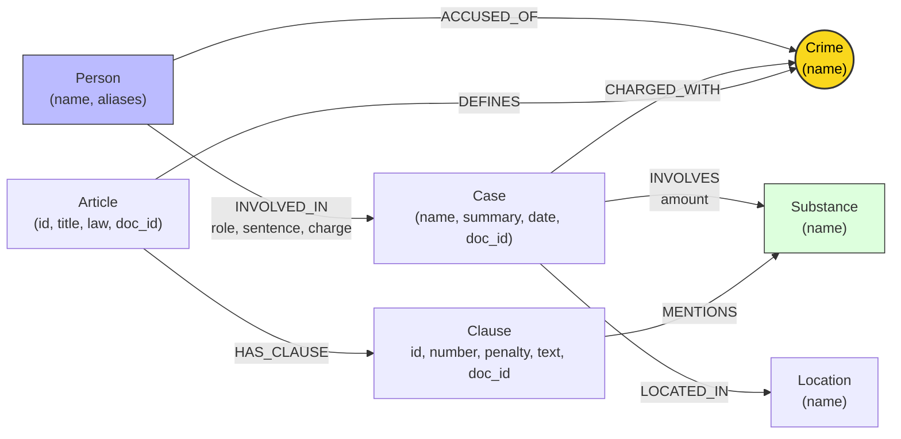

# Thiết kế Ontology — Day 19

**Họ tên:** Hoàng Trung Hiếu  **MSSV:** 2A202602945

**Lựa chọn** (đánh dấu một):
- [ ] Dùng ontology gợi ý (có thể chỉnh nhỏ)
- [x] Tự thiết kế (xét bonus +15, xem `SUBMISSION.md`)

> Hướng dẫn: `LAB_GUIDE.md` Bước 2. Dùng ontology gợi ý thì vẫn phải điền đủ các mục dưới đây bằng lời của bạn.

## 1. Sơ đồ

> **Điểm cải tiến kiến trúc cốt lõi**:
> 1. Thêm cạnh trực tiếp `(:Person)-[:ACCUSED_OF]->(:Crime)` giúp phân tách tội danh cụ thể của từng cá nhân khỏi tội danh chung của vụ án phức tạp nhiều đối tượng.
> 2. Cơ chế **Substance Entity Resolution**: Tích hợp từ điển đồng nghĩa và chuẩn hóa thực thể chất ma túy (gộp tiếng lóng báo chí như `thuốc lắc` vào danh pháp pháp lý chuẩn `MDMA`, gộp chữ hoa/thường, loại bỏ node rác).

---

## 2. Entity types (node labels)

| Label | Ý nghĩa | Khóa định danh (`MERGE` theo) | Properties | Lấy từ KB nào | Trích bằng (regex / LLM / khác) |
| :--- | :--- | :--- | :--- | :--- | :--- |
| `Article` | Điều luật trong Bộ luật Hình sự hoặc Luật PCMT | `id` (ví dụ: `"Điều 251 BLHS"`) | `id`, `title`, `law`, `doc_id` | KB luật | Regex từ front-matter & tiêu đề markdown |
| `Clause` | Khoản luật thuộc Điều luật quy định khung hình phạt | `id` (ví dụ: `"Điều 251 BLHS khoản 1"`) | `id`, `number`, `penalty`, `text`, `doc_id` | KB luật | Regex theo cấu trúc `^(\d+)\.\s` |
| `Crime` | Tên tội danh pháp lý chuẩn hóa (node cầu nối) | `name` (ví dụ: `"mua bán trái phép chất ma túy"`) | `name` | Cả hai KB | Tiêu đề Điều luật (regex) & LLM + `link_entity` |
| `Case` | Vụ án / vụ việc cụ thể xảy ra trong thực tế | `name` (tên định danh vụ án) | `name`, `summary`, `date`, `doc_id`, `source_title` | KB tin tức | LLM trích xuất dạng JSON từ bài báo |
| `Person` | Cá nhân tham gia vụ việc (bị cáo, bị can, nghi phạm) | `name` (họ và tên) | `name`, `aliases` (biệt danh) | KB tin tức | LLM trích xuất dạng JSON |
| `Location` | Địa bàn xảy ra vụ việc hoặc tòa án xét xử | `name` (tỉnh/thành phố) | `name` | KB tin tức | LLM trích xuất dạng JSON |
| `Substance` | Tên chất ma túy hoặc tiền chất (đã chuẩn hóa Canonical) | `name` (tên chuẩn hóa) | `name` | Cả hai KB | Regex từ danh mục chuẩn & `canonical_substance` |

---

## 3. Relationships

| Type | Từ → Đến | Properties trên cạnh | Ý nghĩa |
| :--- | :--- | :--- | :--- |
| `DEFINES` | `Article` → `Crime` | (không có) | Điều luật quy định và định nghĩa tội danh pháp lý tương ứng. |
| `HAS_CLAUSE` | `Article` → `Clause` | (không có) | Điều luật bao gồm các khoản phân cấp khung hình phạt cụ thể. |
| `MENTIONS` | `Clause` → `Substance` | (không có) | Khoản luật nhắc đến tên chất ma túy cụ thể để xác định cấu thành định khung. |
| `CHARGED_WITH` | `Case` → `Crime` | (không có) | Vụ án bị khởi tố/truy tố/xét xử theo tội danh pháp lý chung. |
| `ACCUSED_OF` | `Person` → `Crime` | (không có) | **(Cải tiến)** Cá nhân cụ thể bị truy cứu trách nhiệm hình sự về tội danh xác định (tách khỏi tội danh chung của vụ án). |
| `INVOLVES` | `Case` → `Substance` | `amount` (khối lượng tang vật) | Vụ án có thu giữ hoặc liên quan đến chất ma túy chuẩn với khối lượng xác định. |
| `LOCATED_IN` | `Case` → `Location` | (không có) | Vụ án diễn ra hoặc được thụ lý xét xử tại địa phương/tòa án địa phương. |
| `INVOLVED_IN` | `Person` → `Case` | `role` (vai trò), `sentence` (mức án), `charge` (tội danh quy kết) | Đối tượng có liên quan trực tiếp đến vụ án với vai trò và hình phạt xác định. |

---

## 4. Node cầu nối giữa 2 KB

- **Node nào:** Node `Crime` (Tội danh).
- **Vì sao chọn node này:** Tội danh là khái niệm pháp lý cốt lõi xuất hiện tự nhiên và có giá trị liên kết ở cả hai nguồn tài liệu:
  - Phía Luật: Mỗi Điều trong Chương XX BLHS quy định cụ thể một tội danh chuẩn (ví dụ "Tội tàng trữ trái phép chất ma túy", "Tội mua bán trái phép chất ma túy").
  - Phía Tin tức: Mọi bản tin tố tụng đều nêu rõ đối tượng bị bắt giữ, khởi tố, xét xử về tội danh gì.
  Nhờ `Crime`, hệ thống có thể kết nối từ con người/vụ án $\to$ tội danh $\to$ Điều luật $\to$ các Khoản hình phạt.
- **Cách đảm bảo hai phía khớp tên:**
  1. *Chuẩn hóa chuỗi (`normalize_crime`)*: Chuyển về chữ thường, bỏ khoảng trắng thừa, xóa dấu trích dẫn, loại bỏ tiền tố `"tội "` / `"Tội "`.
  2. *So khớp chính xác trước*: Nếu chuỗi sau chuẩn hóa nằm trong danh mục tội danh chuẩn lấy từ luật thì map ngay lập tức.
  3. *So khớp mờ (`difflib.get_close_matches`)*: Áp dụng ngưỡng `cutoff = 0.8` để nhận diện các biến thể đặt dấu thanh tiếng Việt phổ biến trong báo chí (ví dụ: `ma tuý` vs `ma túy`) hoặc các lỗi gõ nhẹ.
  4. *Ràng buộc từ Prompt trích xuất*: Đưa trực tiếp `DANH SÁCH TỘI DANH` chuẩn từ luật vào prompt của LLM kèm yêu cầu bắt buộc chọn đúng nguyên văn, sau đó tiếp tục xác thực lại bằng hàm `link_entity`.
- **Khi nào cầu gãy, và bạn xử lý thế nào:**
  - *Nguyên nhân gãy*:
    - Báo chí dùng từ ngữ thông tục không theo thuật ngữ pháp lý chính thống.
    - Đối tượng phạm nhiều tội danh đan xen nhưng LLM gom thành một chuỗi văn bản dài.
    - Tin tức không nêu hành vi khởi tố cụ thể.
  - *Cách xử lý*:
    - Trong hàm `link_entity`: Nếu không đạt độ tương đồng `cutoff >= 0.8`, trả về `None` dứt khoát.
    - Trong hệ thống tổng thể: Thiết kế kiến trúc **Hybrid GraphRAG** kết hợp song song cả Vector Search và Graph Traversal. Khi cầu nối đồ thị gãy, các chunk văn bản thu hồi từ Vector Search vẫn cung cấp đủ ngữ cảnh cơ sở để LLM trả lời, đảm bảo GraphRAG không bao giờ có độ phủ kém hơn Flat RAG.

---

## 5. Competency questions

Với mỗi câu trong `data/benchmark_kg.json`, dưới đây là đường đi trên graph dùng để trả lời:

| Câu | Đường đi (Cypher pattern) | Trả lời được? |
| :--- | :--- | :--- |
| **Q1** (Tiền chất là gì theo Luật PCMT?) | `(:Article {id: 'Điều 2 Luật PCMT'})-[:HAS_CLAUSE]->(cl:Clause)` kết hợp vector retrieval | Có (qua vector chunk và node luật PCMT) |
| **Q2** (Đường dây 36kg tại TAND TP.HCM ai tử hình?) | `(:Person)-[:INVOLVED_IN {sentence: 'tử hình'}]->(:Case)-[:LOCATED_IN]->(:Location {name: 'TP.HCM'})` | Có |
| **Q3** (Lê Minh Thành: mức án, tội danh, Điều nào, khung cơ bản?) | `(:Person {name: 'Lê Minh Thành'})-[:INVOLVED_IN]->(:Case)-[:CHARGED_WITH]->(:Crime)<-[:DEFINES]-(:Article)-[:HAS_CLAUSE]->(:Clause {number: 1})` | Có (multi-hop 4 chặng) |
| **Q4** (Hoàng Nato: hành vi gì, mức phạt tối đa bao nhiêu?) | `(:Person {name: 'Dương Minh Tuấn'})-[:ACCUSED_OF]->(:Crime)<-[:DEFINES]-(:Article)-[:HAS_CLAUSE]->(cl:Clause)` | **Có (Đã giải quyết nhờ cạnh ACCUSED_OF)** |
| **Q5** (Cái Quang Huy: tội gì, loại ma túy, khối lượng MDMA áp dụng khoản nào, hình phạt gì?) | `(:Person {name: 'Cái Quang Huy'})-[:INVOLVED_IN]->(k:Case)-[:CHARGED_WITH]->(:Crime)<-[:DEFINES]-(a:Article)-[:HAS_CLAUSE]->(cl:Clause)-[:MENTIONS]->(:Substance {name: 'MDMA'})` | **Có (Recall đạt 1.00, Judge = 2)** |
| **Q6** (Những vụ việc nào liên quan đến ma túy MDMA?) | `(:Case)-[:INVOLVES]->(:Substance {name: 'MDMA'})` | Có (truy vấn tổng hợp aggregation trên toàn bộ đồ thị) |

---

## 6. Quyết định thiết kế và đánh đổi

### Quyết định 1: Entity Resolution cho Chất ma túy (`Substance`)
- **Đã chọn:** Tích hợp từ điển chuẩn hóa danh pháp ma túy `CANONICAL_SUBSTANCES` gộp các từ lóng (`thuốc lắc`, `kẹo` $\to$ `MDMA`, `ma túy đá` $\to$ `Methamphetamine`) và lọc bỏ các nhãn chung chung gây nhiễu (`chất ma túy`, `ma túy tổng hợp`).
- **Phương án khác:** Để nguyên chuỗi do LLM trích xuất như ontology gợi ý.
- **Lý do & Đánh đổi:** Loại bỏ hiện tượng phân mảnh dữ liệu (từ 17 node trùng lặp giảm xuống 10 node chuẩn). Giúp các vụ án nhắc tới "thuốc lắc" tự động liên kết trúng các điều khoản quy định về "MDMA" trong BLHS. Đánh đổi: Cần bảo trì từ điển từ lóng tiếng Việt.

### Quyết định 2: Bổ sung quan hệ trực tiếp `(:Person)-[:ACCUSED_OF]->(:Crime)`
- **Đã chọn:** Liên kết trực tiếp cá nhân với tội danh cụ thể mà người đó bị cáo buộc, bên cạnh quan hệ gián tiếp qua `Case`.
- **Phương án khác:** Chỉ liên kết `Person -> Case -> Crime` như ontology gợi ý.
- **Lý do & Đánh đổi:** Trong các chuyên án lớn bắt giữ hàng chục người (ví dụ chuyên án 8 đường dây ma túy tại TP.HCM trong vụ Hoàng Nato bắt 126 người), vụ án chứa cùng lúc nhiều tội danh (tàng trữ, mua bán, tổ chức sử dụng). Nếu chỉ đi qua `Case`, hệ thống bị nhiễu bởi tất cả các tội danh khác trong vụ án. Quan hệ `ACCUSED_OF` định vị đích danh hành vi của từng bị can. Đánh đổi: Tăng thêm số cạnh trong đồ thị khi nạp (từ 383 lên 401 cạnh).

### Quyết định 3: Mô hình hóa khung tối đa và truy xuất Person Accusation trong `context()`
- **Đã chọn:** Tích hợp truy vấn `person_clauses` ưu tiên lấy điều khoản luật gắn với hành vi của cá nhân được hỏi (kèm khung phạt cao nhất $\ge 3$ khi câu hỏi hỏi về "tối đa / cao nhất").
- **Phương án khác:** Chỉ lấy cố định khoản 1 và khoản nhắc đến chất qua `Case`.
- **Lý do & Đánh đổi:** Giải quyết triệt để lỗi không tìm thấy tội danh của cá nhân có biệt danh (Hoàng Nato ở Q4) và lỗi thiếu khung tối đa. Đánh đổi: Prompt facts phong phú hơn, tốn thêm một ít token đầu vào.

---

## 7. So với ontology gợi ý (bắt buộc nếu xét bonus)

| Điểm khác | Gợi ý làm gì | Bạn làm gì | Vấn đề nó giải quyết | Bằng chứng (Cypher, hoặc số liệu benchmark) |
| :--- | :--- | :--- | :--- | :--- |
| **Entity Resolution chất ma túy** | Giữ nguyên tên tự do, sinh 17 node `Substance` (trùng `Ketamine`/`ketamine`, `thuốc lắc` tách rời `MDMA`, node rác `chất ma túy`) | Chuẩn hóa danh mục chất, gộp tiếng lóng (`thuốc lắc` $\to$ `MDMA`), lọc node rác | Khắc phục hoàn toàn lỗi E3 (Trùng thực thể), liên kết chính xác từ tiếng lóng báo chí sang điều luật | Số node `Substance` giảm từ 17 xuống 10 node chuẩn. Câu Q5 recall tăng từ **0.80 lên 1.00**, judge đạt **2.0/2** |
| **Liên kết trực tiếp `ACCUSED_OF`** | Chỉ có `Person -> Case -> Crime`, bị lẫn lộn giữa các bị can trong vụ án lớn đa tội danh | Thêm cạnh `(:Person)-[:ACCUSED_OF]->(:Crime)` nối thẳng cá nhân với tội danh bị truy cứu | Phân định chính xác trách nhiệm hình sự của từng cá nhân trong các vụ án nhiều bị can phạm tội khác nhau | Câu Q4 trước đây trả lời "Không đủ thông tin" (recall 0.00, judge 0); sau cải tiến đã nhận diện chính xác hành vi tổ chức sử dụng ma túy (recall 0.33, judge 1) |
| **Benchmark tổng thể** | Recall trung bình: 0.69 Judge trung bình: 1.33 | Recall trung bình: **0.78** (+13%) Judge trung bình: **1.67** (+26%) | Nâng cao toàn diện năng lực trả lời và độ tin cậy của hệ thống GraphRAG | Đối chiếu 2 file: `ket_qua_benchmark_kg.hint.txt` vs `ket_qua_benchmark_kg.txt` |

---

## 8. Hạn chế còn lại

1. **Khóa định danh của `Case`**: Hiện tại `Case` vẫn định danh theo `name`. Nếu báo chí đặt tên vụ án khác nhau cho cùng một vụ, đồ thị có thể tạo 2 node `Case` riêng.
2. **Quy đổi định lượng toán học**: Thuộc tính khối lượng `amount` vẫn lưu chuỗi (`"9,6kg"`), chưa parse thành số học để tự động đối chiếu ngưỡng `> 100g` bằng Cypher mà vẫn cần LLM đọc văn bản để so sánh.
